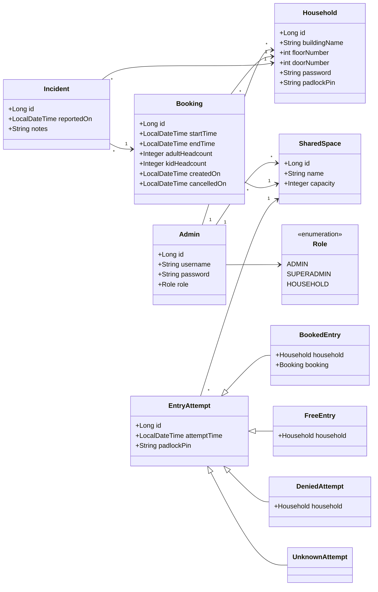

# 🦆 DuckyTime


A REST API for booking the shared spaces in a residential building — the community pool, the rooftop terrace, the laundry room, the co-working corner, that kind of thing. Buildings have an admin who sets up the spaces and registers each household; households then book slots and physically get in by typing a PIN into the door's padlock.

## Description

Most buildings have a couple of shared spaces and no good way to manage them. People show up at the same time, the space is over capacity, nobody knows who left the mess. DuckyTime is the backend that fixes that.

There are two kinds of users:

- **Admins** run a building. They create shared spaces (each with a maximum capacity), register households, and can audit everything that happens — every booking, every door entry, every incident report.
- **Households** book time in a shared space. The API only offers them slots that still have room, enforces a few house rules (bookings are on the hour, three hours max, in the future), and lets them cancel or report a problem with a booking afterwards.

The interesting part is the door. Each shared space has a padlock, and each household has a 4-digit PIN. When someone punches in a PIN, the API decides what to do and records the attempt:

- **Unknown PIN** → rejected and logged as an `UnknownAttempt`.
- **Outside booking hours** (before 06:00 or after 21:00) → let in as a `FreeEntry`, no booking needed.
- **During booking hours with an active booking** → let in as a `BookedEntry`.
- **During booking hours without a booking** → rejected and logged as a `DeniedAttempt`.

Every attempt is stored, so the admin gets a full log of who tried to get in, when, and whether it worked.

Availability is worked out in SQL: a recursive query builds every hourly slot for the next 7 days, sums up the headcount already booked into each hour, and only returns the slots where the requested group still fits under the space's capacity.

## Class Diagram

The entry-attempt hierarchy uses JPA's **JOINED** inheritance strategy: a base `entry_attempts` table holds the common columns, and each subtype (`booked_entries`, `free_entries`, `denied_attempts`, `unknown_attempts`) gets its own table joined on the shared id. JOINED was the right fit here because the subtypes carry genuinely different relationships — a booked entry points at a booking, an unknown attempt has no household at all — and a single wide table would have been full of nulls.



> `AvailableSlot` is not in the diagram because it isn't an entity — it's a read-only model derived from the availability SQL query.

## Setup

You need Docker (for the database), Java 25, and the Maven wrapper that ships with the repo.

1. Clone the repo and step into it:
   ```bash
   git clone <your-repo-url>
   cd DuckyTime
   ```

2. Make sure Docker is running. You don't need to start MySQL by hand — Spring Boot's Docker Compose support reads `compose.yaml` and brings up the database automatically when the app boots.

3. Run the app:
   ```bash
   ./mvnw spring-boot:run
   ```

On the first start a seed admin is created so you have something to log in with:

| Username | Password  |
| -------- | --------- |
| `alex`   | `alex123` |

The API is then available at `http://localhost:8080`. Interactive API docs (Swagger UI) are at `http://localhost:8080/swagger-ui.html`.

### Logging in

Authentication is JWT bearer tokens. POST your credentials to `/api/login` and you get back an `access_token`:

```bash
curl -X POST http://localhost:8080/api/login \
  -H "Content-Type: application/json" \
  -d '{"username": "alex", "password": "alex123"}'
```

Send that token on every other request:

```bash
curl http://localhost:8080/api/shared_spaces \
  -H "Authorization: Bearer <access_token>"
```

Household usernames aren't free text — they're built from the address the admin registered, joined with underscores: `buildingName_floorNumber_doorNumber` (e.g. `RoseCourt_2_4`). The password is whatever the admin set when creating the household.

## Technologies Used

- **Java 25**
- **Spring Boot 4** — Web MVC, Data JPA, Security
- **Spring Security** with stateless JWT bearer authentication (custom authentication and authorization filters)
- **java-jwt** (Auth0) for signing and verifying tokens
- **MySQL 8** as the database, managed through JPA / Hibernate
- **Docker Compose** to run MySQL locally
- **Lombok** to cut down on boilerplate
- **springdoc-openapi** for Swagger UI
- **Maven** (via the bundled wrapper) for builds

## Controllers and Routes

All routes are prefixed with `/api`. `/api/login` is public; everything else needs a bearer token, and access is split by role.

### Public

| Method | Route        | Description                              |
| ------ | ------------ | ---------------------------------------- |
| POST   | `/api/login` | Log in, returns a JWT `access_token`     |

### Admin routes (`ROLE_ADMIN`)

| Method | Route                       | Description                                       |
| ------ | --------------------------- | ------------------------------------------------- |
| POST   | `/api/shared_spaces`        | Create a shared space                             |
| GET    | `/api/shared_spaces`        | List the admin's shared spaces                    |
| GET    | `/api/shared_spaces/{id}`   | Get one shared space                              |
| PUT    | `/api/shared_spaces/{id}`   | Rename a shared space                             |
| DELETE | `/api/shared_spaces/{id}`   | Delete a shared space                             |
| POST   | `/api/households`           | Register a household                              |
| GET    | `/api/households`           | List the admin's households                       |
| GET    | `/api/households/{id}`      | Get one household                                 |
| DELETE | `/api/households/{id}`      | Delete a household                                |
| POST   | `/api/shared_spaces/{id}/entries` | Attempt a door entry with a padlock PIN     |
| GET    | `/api/bookings`             | Audit every booking across the admin's spaces     |
| GET    | `/api/entries`              | Audit every door-entry attempt                    |
| GET    | `/api/incidents`            | Audit every reported incident                     |

### Household routes (`ROLE_HOUSEHOLD`)

| Method | Route                                                       | Description                                  |
| ------ | ----------------------------------------------------------- | -------------------------------------------- |
| GET    | `/api/shared_spaces/{sharedSpaceId}/available_slots`        | List bookable hourly slots (next 7 days)     |
| POST   | `/api/shared_spaces/{sharedSpaceId}/bookings`               | Create a booking                             |
| GET    | `/api/shared_spaces/{sharedSpaceId}/bookings`               | List your bookings in that space             |
| DELETE | `/api/shared_spaces/{sharedSpaceId}/bookings/{id}`          | Cancel a future booking                      |
| POST   | `/api/shared_spaces/{sharedSpaceId}/bookings/{bookingId}/incidents` | Report an incident about a booking   |

A note on the entry endpoint: it lives under `/api/shared_spaces/**` and is authorised as the admin, since the padlock device belongs to the building rather than to any single household.

## Extra Links

- **Presentation Slides:** _add link here_
- **Project Management Board:** _add link here_

## Future Work

- Role-based authorisation is in place for `ADMIN` and `HOUSEHOLD`; the `SUPERADMIN` role exists in the model but isn't wired up yet — the next step would be a superadmin who can invite and manage `ADMIN`s.
- Move the JWT signing secret out of the source code and into configuration / environment variables.
- Let admins resolve or close incidents rather than only listing them.
- Add the ability to include pictures in incidents.
- Make booking hours and the maximum length configurable per shared space instead of hard-coded.

## Team Members

- **Amber** — sole author

## License

Released under the MIT License.
